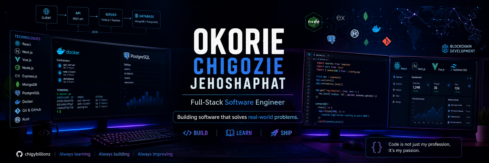

<!-- ========================================================= -->
<!--                    HERO SECTION                           -->
<!-- ========================================================= -->

  

 
<h1 align="center">
Okorie Chigozie Jehoshaphat
</h1>

<h3 align="center">
Full-Stack Software Engineer • Backend Engineer
</h3>

Building software that solves real-world problems.

Open Source Contributor • Hackathon Enthusiast • Lifelong Learner

  

---

## 👨‍💻 About Me

I'm a Full-Stack Software Engineer passionate about designing scalable applications and creating intuitive digital experiences.

I enjoy building reliable backend systems, modern frontend interfaces, and developer-focused solutions using technologies like React, Next.js, Node.js, Express, and MongoDB. Beyond coding, I actively contribute to open source, participate in hackathons, and continuously explore cloud, AI, and blockchain technologies.

- 🔭 Currently building full-stack applications with **React, Next.js, Node.js, Express & MongoDB**
- 🌱 Currently learning **Cloud Technologies, Blockchain Development, AI Engineering & System Design**
- 💡 Interested in **REST APIs, SaaS Platforms, AI-powered Tools, Blockchain Applications & Developer Tools**
- 🤝 Open to collaborating on **Open Source, Full-Stack Projects, Backend Systems and Hackathons**

---

## 🚀 Current Mission

> Building scalable full-stack applications, contributing to open source, participating in hackathons, and deepening my knowledge of backend systems, cloud technologies, and blockchain development.

---

# 📌 Currently Working On

- 🚀 Building **MarketPulse**, a digital journaling platform for traders.
- 🌍 Contributing to open-source projects and collaborative software.
- 🏆 Participating in hackathons and developer communities.
- 📚 Deepening my expertise in cloud technologies, AI, and blockchain development.

---

# 🛠️ Tech Stack

### 🎨 Frontend

  

### ⚙️ Backend

  

### 🗄️ Database

  

### 🚀 DevOps & Tools

  

### ⛓️ Blockchain

  

Currently exploring smart contract development with <strong>ink!</strong> and blockchain ecosystems.

---

# 🚀 Featured Projects

## 📈 MarketPulse *(Private)*

A full-stack digital journaling platform that helps traders organize, document, and review their trading activities through structured record keeping.

**Stack:** React • Tailwind CSS • Express.js • MongoDB

---

## 👥 Attendance System

A web application for managing attendance records efficiently with a simple and responsive interface.

**Stack:** React • Node.js • Express.js • Mysql

---

## 🏢 Backend Assessment

A collection of backend services demonstrating authentication, RESTful API development, and database design.

**Stack:** Node.js • Express.js • PostgreSQL

---

## 📚 Travel Genesis
Open-source contribution focused on collaborative development and feature implementation.
---
# 🌍 Open Source

I enjoy collaborating on community-driven software and learning from experienced developers through open source.

Some of the communities and projects I've contributed to include:

- 💧 Drips Stellar Waves
- 🦊 GrantFox
I'm always open to contributing to meaningful open-source initiatives.

---

# 🏆 Hackathons

Hackathons allow me to challenge myself, collaborate with other developers, and build products under tight deadlines.

Although I'm still early in my hackathon journey, they've helped me improve my engineering mindset, teamwork, and rapid product development skills.

I'm excited to continue participating in more local and global hackathons while building solutions that create real impact.

---

# 📊 GitHub Analytics

---

# ⚡ Current Toolbox

---

# 🤝 Let's Connect

Let's build something amazing together 🚀

---
---

Thank you for visiting my profile.

I'm always open to learning, collaborating, and building software that creates real-world impact.

⭐ Feel free to explore my repositories and connect with me.

